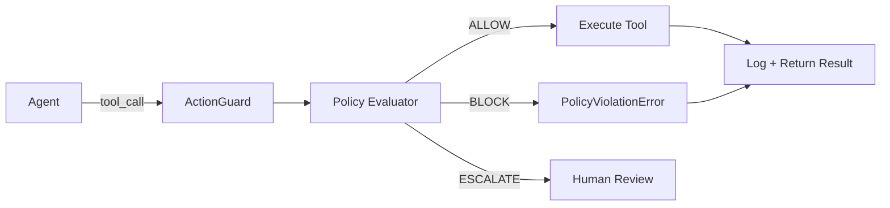

# Core Concepts

## How It Works

Every tool call your agent makes flows through Plyra Guard's evaluation pipeline:



## Key Concepts

### ActionGuard

The central object. One instance per agent (or shared across agents). Holds your policy, exporters, and action history.

```python
guard = ActionGuard(
    policy=my_policy,       # optional — defaults to sensible rules
    exporters=[...],        # optional — stdout, OTEL, Datadog
    snapshot_path="~/.plyra/snapshots.db"  # optional — local SQLite history
)
```

### Policy

A policy is an ordered list of **Rules**. The first matching rule wins.

```python
policy = Policy(rules=[
    Rule(pattern=r"^/etc/", action="block"),
    Rule(pattern=r"^/tmp/", action="allow"),
    Rule(pattern=".*",      action="block"),  # default deny
])
```

### Rule

A rule has three parts:

| Field | Type | Description |
|-------|------|-------------|
| `pattern` | `str` | Regex matched against the intent string |
| `action` | `"allow"` \| `"block"` \| `"escalate"` | What to do on match |
| `reason` | `str` | Human-readable explanation (logged) |

### Intent

When your agent calls a wrapped tool, Plyra Guard extracts an **intent string** from the call arguments. This string is what gets matched against your policy rules.

By default, intent is the concatenation of all string arguments. You can customise it:

```python
@guard.wrap(intent_fn=lambda args, kwargs: kwargs.get("path", ""))
def delete_file(path: str) -> None:
    ...
```

### Outcomes

| Outcome | Meaning |
|---------|---------|
| `ALLOW` | Tool executed normally |
| `BLOCK` | Tool not executed, `PolicyViolationError` raised |
| `ESCALATE` | Paused, waiting for human approval (async) |
| `ERROR` | Tool raised an exception (still logged) |

### Action Log

Every call — allowed or blocked — is written to the action log. By default this is an in-memory ring buffer + optional SQLite snapshot file at `~/.plyra/snapshots.db`.

```python
# Query recent actions
actions = guard.history(limit=50, outcome="BLOCK")
for a in actions:
    print(f"{a.tool_name} | {a.intent} | {a.outcome} | {a.latency_ms}ms")
```
